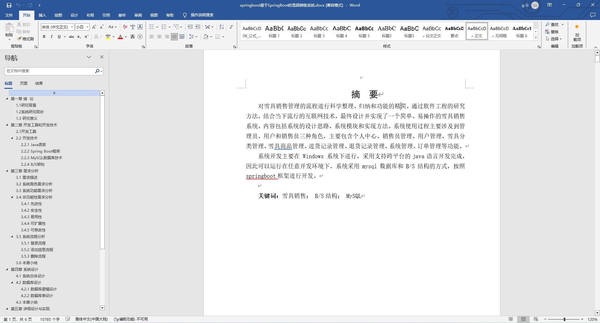
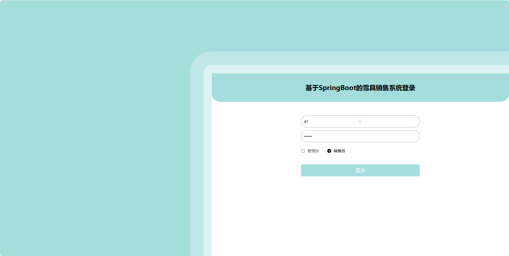
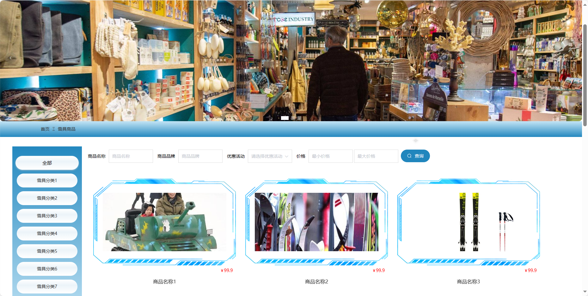
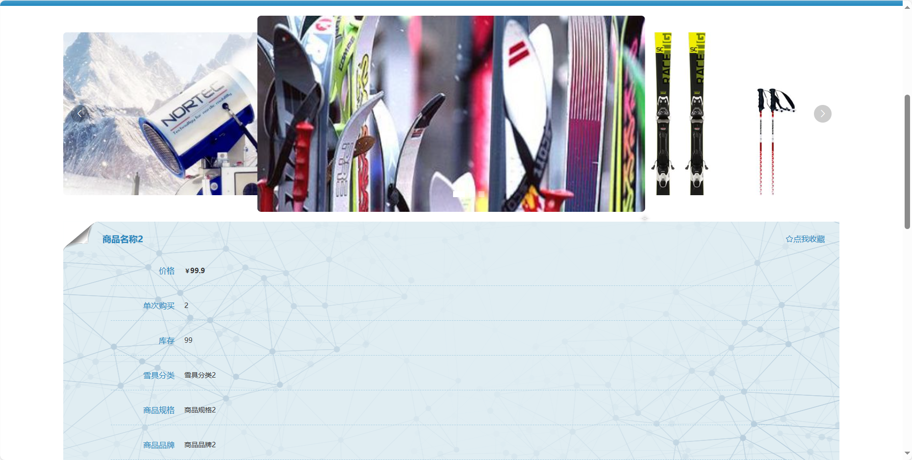
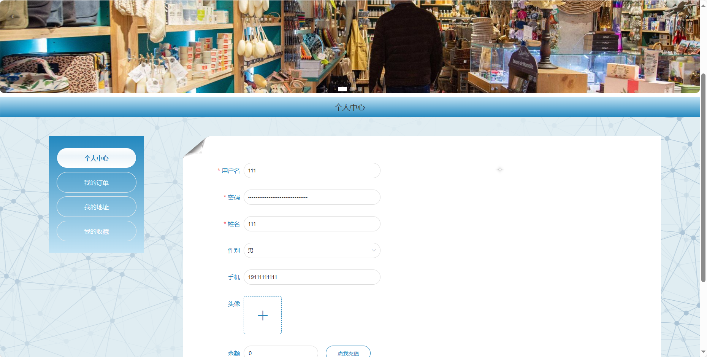
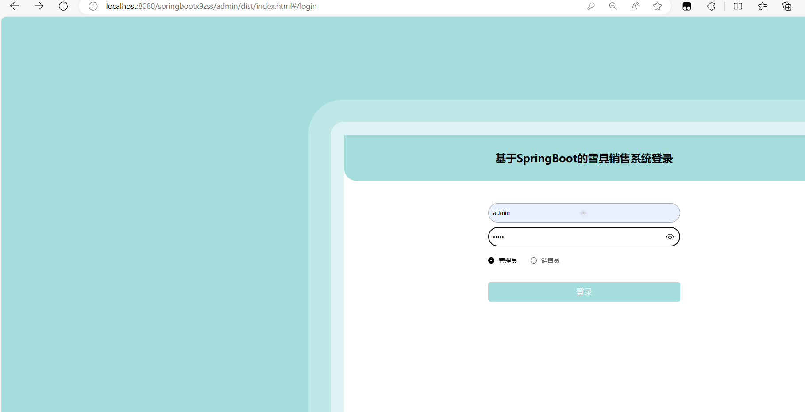
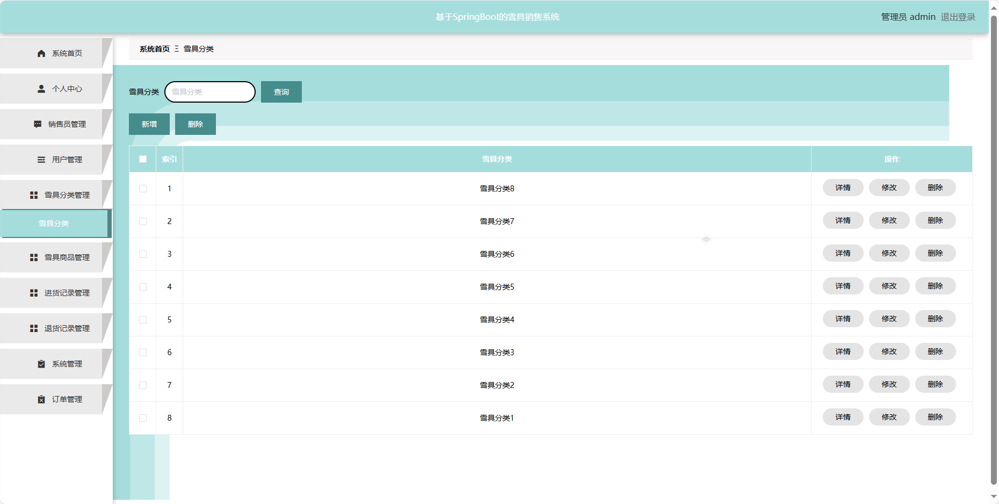

基于Springboot的雪具销售系统（程序+论文）
=
### 完整代码获取地址：从戎源码网 ([https://armycodes.com/](https://armycodes.com/))
### 作者微信：19941326836  QQ：952045282 
### 承接计算机毕业设计、Java毕业设计、Python毕业设计、深度学习、机器学习
### 选题+开题报告+任务书+程序定制+安装调试+论文+答辩ppt 一条龙服务
### 所有选题地址https://github.com/nature924/allProject

一、项目介绍
---
基于Spring Boot框架实现的雪具销售系统，系统包含三种角色：管理员、用户,销售员，系统分为前台和后台两大模块，主要功能如下。
### 首页：展示系统的主要信息和推荐内容。
雪具商品：列出可购买的雪具商品列表。
公告信息：显示系统相关的公告和通知信息。
客服中心：提供在线客服支持。
购物车：管理用户选择的商品，。
个人中心：用户个人信息管理，订单历史、个人设置等。
### 【管理员后台功能】
- 系统首页：管理员后台的主页。
- 个人中心：管理员个人信息管理，修改密码和查看个人信息。
- 销售员管理：添加、编辑、删除销售员账号。
- 用户管理：添加、编辑、删除用户账号。
- 雪具分类管理：管理雪具商品的分类信息。
- 雪具商品管理：添加、编辑、删除雪具商品信息。
- 进货记录管理：查看和管理雪具商品的进货记录。
- 退货记录管理：查看和管理雪具商品的退货记录。
- 系统管理：系统参数的管理，如雪具商品的计量单位等。
- 订单管理：查看和管理用户购物订单信息。

### 【销售员后台功能】
- 系统首页：销售员后台的主页。
- 个人中心：销售员个人信息管理。
- 雪具分类管理：管理雪具商品的分类信息。
- 雪具商品管理：添加、编辑、删除雪具商品信息。
- 进货记录管理：查看和管理雪具商品的进货记录。
- 退货记录管理：查看和管理雪具商品的退货记录。
- 订单管理：查看和管理用户购物订单信息。

二、项目技术
---
- 编程语言：Java
- 数据库：MySQL
- 项目管理工具：Maven
- 前端技术：VUE、HTML、Jquery、Bootstrap
- 后端技术：Spring、SpringMVC、MyBatis

三、运行环境
---
- 操作系统：Windows、macOS都可以
- JDK版本：JDK1.8以上都可以
- 开发工具：IDEA、Ecplise、Myecplise都可以
- 数据库: MySQL5.7以上都可以
- Tomcat：任意版本都可以
- Maven：任意版本都可以

四、运行截图
---
### 论文截图：

### 程序截图：

